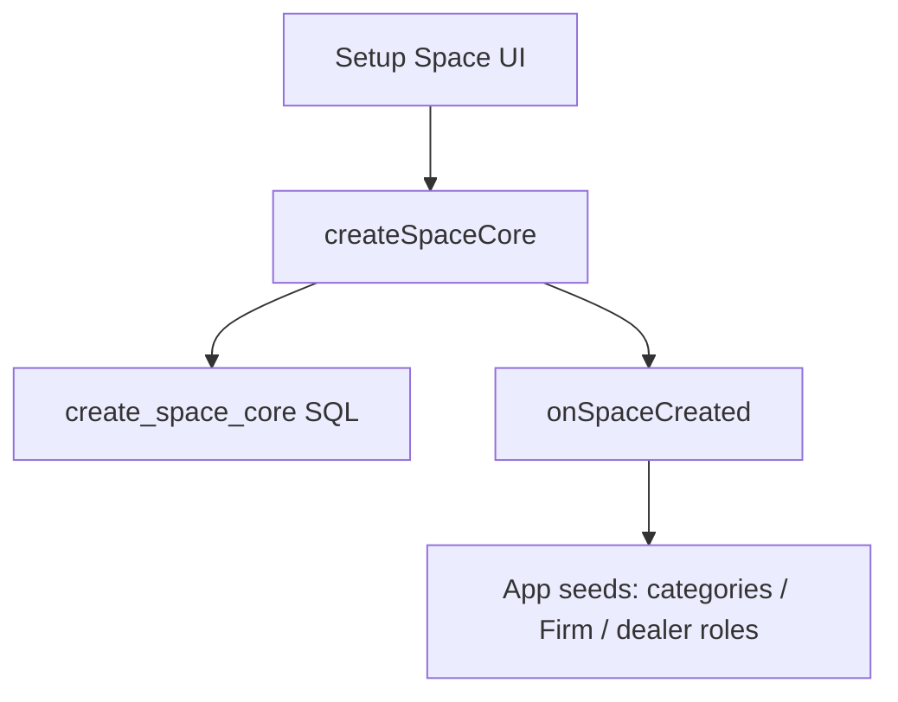

# Architecture — Adaven Platform

## Constraints

- Share **code**, not accounts. Vouchap, Wholestore, and future apps each have independent Supabase and registration.
- Third-party login (Google, Apple, Microsoft, …) is a **platform** capability. Credentials, bundle IDs, and Supabase Auth providers are **per app**.
- **One git repo, independent product ships.** Platform package changes on `main` are not a store release. Each app is built from `apps/<name>` with EAS / Cloudflare when that product is ready.

## Source of truth

| What | Where |
|---|---|
| Vouchap **app** (Expo / EAS / web export) | `apps/vouchap-app` in this repo |
| Platform kernel | `packages/*` in this repo |
| Historical Vouchap git backup | https://github.com/jamesgao27/Vouchap — **do not iterate the app there** |
| vouchap-website / vouchap-crm | stay in their own GitHub repos |

EAS `projectId` (`f98c5cea-fd51-41e3-9c9c-1512c6b1a8e7`) and bundle id `com.vouchap.app` are unchanged.

## Layout

```text
Adaven-platform/
  packages/
    platform-core/
    platform-ui/
    db-platform/
  apps/
    vouchap-app/
  docs/ARCHITECTURE-PLATFORM.md
```

Vouchap depends on `@adaven/platform-core` and `@adaven/platform-ui` at a **pinned semver** (currently `0.1.0`). npm workspaces link the local packages. Bump the app dependency when that product should pick up a new platform version.

## Space creation



- `create_space_core`: `spaces` + `user_spaces` + `current_space_id` only.
- Vouchap currently still calls product RPC `create_space_with_user` (Firm/CRM seeds in SQL) **and** the JS hook for client categories / Firm SKU fallback.
- New apps should use `create_space_core` + `registerOnSpaceCreated` only.

## Roles

Platform stores `user_spaces.role` as text (Vouchap still has compatible `is_admin`). Do not put Firm `kind` on the platform-required `spaces` schema.

## Independent release

1. Change platform package on `main` — this is **not** a Vouchap store update by itself.
2. When Vouchap should pick it up: build/submit **from `apps/vouchap-app`** (EAS / Cloudflare).
3. When Wholestore should pick it up: build **that** app only. Vouchap stays on whatever binary was last submitted.
4. Run `db-platform` SQL on **that** app's Supabase only, when ready.
