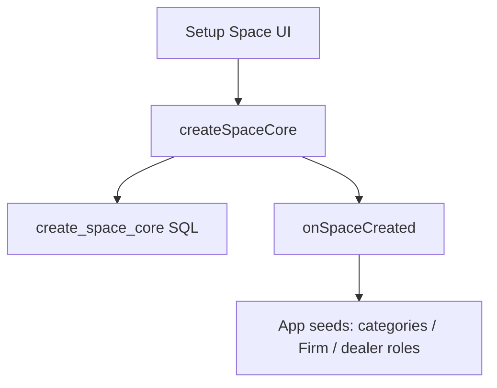

# Architecture — Adaven Platform

## Constraints

- Share **code**, not accounts. Vouchap, Wholestore, and future apps each have independent Supabase and registration.
- Third-party login (Google, Apple, Microsoft, …) is a **platform** capability. Credentials, bundle IDs, and Supabase Auth providers are **per app**.
- Platform packages version independently (semver). Each app bumps and builds on its own schedule.

## Layout

```text
Adaven-platform/
  packages/
    platform-core/
    platform-ui/
    db-platform/
  apps/                 # vouchap-app native tree not moved yet; Vouchap uses file: deps
  docs/ARCHITECTURE-PLATFORM.md
```

Vouchap (`/Users/macbook/Vouchap/vouchap-app`) depends on `@adaven/platform-core` and `@adaven/platform-ui` via `file:` + Metro `watchFolders`. Product overlay (`createSpace` + Firm RPC, `vouchap-space-bootstrap`) stays in Vouchap. **SQL in `db-platform` is not applied yet.**

## Space creation



- `create_space_core`: `spaces` + `user_spaces` + `current_space_id` only.
- Vouchap currently still calls product RPC `create_space_with_user` (Firm/CRM seeds in SQL) **and** the JS hook for client categories / Firm SKU fallback.
- New apps should use `create_space_core` + `registerOnSpaceCreated` only.

## Roles

Platform stores `user_spaces.role` as text (Vouchap still has compatible `is_admin`). Do not put Firm `kind` on the platform-required `spaces` schema.

## Independent release

1. Change platform package → changeset / semver.
2. Each app updates the dependency, then EAS / Cloudflare for **that** app only.
3. Run `db-platform` SQL on **that** app's Supabase.
