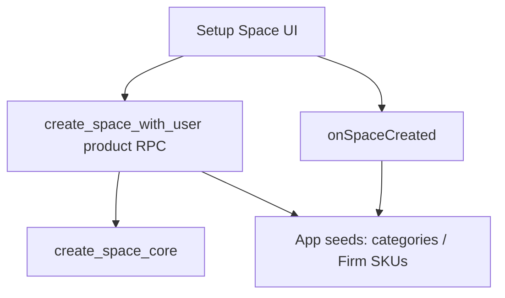

# Architecture — Adaven Platform

## Constraints

- Share **kernel code and space kinds**, not accounts. Each product is an independent business app: **its own Supabase**, **its own `auth.users`**, own OAuth clients. Users do not share a login across apps.
- Kernel `spaces.kind` is only **`provider` | `consumer`**. Product copy maps those two values (Portalflow: Firm / Client; Wholestore: Vendor / Dealer; future B2B apps: other labels). Do not invent a third kernel kind per product.
- Third-party login (Google, Apple, Microsoft, …) is a **platform** capability. Credentials, bundle IDs, and Supabase Auth providers are **per app**.
- **One git repo, one kernel, independent product ships.** `packages/*` is always HEAD for every app (no per-app kernel pin). Platform changes on `main` are not a production release. Web ships via GitHub Actions path filters → Wrangler Direct Upload (one app per matching path), or that app’s CLI / EAS. **Never** Git-connect Cloudflare Pages to this repo (one push would rebuild every connected app).

## Source of truth

| What | Where |
|---|---|
| Vouchap **live** (independent) | Original repo `jamesgao27/Vouchap` + Supabase `giuacjbfsyrristkigmz` (`kind` = `firm`/`client`) + Pages `vouchap`. Full standalone app — **do not** depend on this repo or `@adaven/platform-*`. Do not migrate its users. |
| **Portalflow** (new) | `apps/portalflow-app`. Business aligned with Vouchap. Kernel `provider`/`consumer`, UI Firm/Client. **New empty Supabase** + Pages **`portalflow`**. No Vouchap user import. |
| Wholestore | `apps/wholestore-app` → Supabase `foyecolycmxcneflpant` |
| **Adaven-CRM Hub** | Standalone repo `Adaven-CRM` (package `adaven-crm`) → Supabase **`glwacznypahmlpwottfz`**. Ops Auth only; not a product tenant. |
| Platform kernel | `packages/*` (code only, not a tenant) |

Portalflow native identity is new (`com.portalflow.app`, scheme `portalflow`). Do **not** reuse Vouchap EAS `projectId` (`f98c5cea-…`) or bundle `com.vouchap.app`. Create a new EAS app when first building native.

Cloudflare Pages projects are **Direct Upload** (`wrangler pages deploy` from `apps/portalflow-app` or `apps/wholestore-app`). Git source of the code is `jamesgao27/Adaven-platform`; Pages must **not** be Git-connected. Auto-publish is GitHub Actions with per-app path filters. See `docs/PUBLISH.md`.

## Information architecture

- **Kernel UI**: login / register / reset-password / setup-space / handle-invitations / invite, plus **Management** (space info, personal info, switch space, sign out, Members, Space roles). Apps `export { ManagementScreen as default } from '@adaven/platform-ui'`.
- **Web left sidebar**: chrome only (brand, current space → Management, user card → Management, invitation badge). **Every nav column is a product business page** (`getSidebarNavItems`). Do not put Team / Space roles in the rail.
- Product extras on Management use `getManagementMenuItems` (Portalflow: Accounts, Firm Permissions, billing, …).
- Shared list chrome (`DataTable`, `CenterModal`, `ProjectListCard` / `ProjectListRow`) lives in `platform-ui`. Wholestore Vendor maps Portalflow/Vouchap Firm: Dealers ← Clients, Orders ← Engagements (multi-SKU lines), Catalog ← Service Catalog (SKU without items).

## Space kinds (kernel vs product)

Kernel stores **two** kinds. Apps only change **labels and overlay tables**, not the enum.

| Kernel (`spaces.kind`) | Meaning | Portalflow UI | Wholestore UI | Future apps |
|------------------------|---------|---------------|---------------|-------------|
| `provider` | Supplies catalog / services to the other side | **Firm** | **Vendor** | other B2B role name |
| `consumer` | Buys / enrolls / is served | **Client** | **Dealer** | other B2B role name |

- SQL / `platform-core` / RLS / RPCs use `provider` and `consumer` only.
- `configureProductUi({ spaceKinds: [{ id: 'provider', label: 'Firm' }, …] })` is how a product shows its vocabulary.
- Product overlay schemas use `provider.*` / `consumer.*` identifiers only. **Firm / Client / Vendor / Dealer are UI labels**, not SQL names. **`public.spaces.kind` is always kernel `provider`/`consumer`**. Portalflow still has extra overlay tables (SKU items, groups, permission roles, tax) that Wholestore does not.
- Frozen original Vouchap still writes `firm`/`client` into **its** production DB. Portalflow never writes to that database.

**Wholestore** overlay SQL uses `provider`/`consumer` only (UI copy is Vendor / Dealer; some screens still say supplier/factory).

## Layout

```text
Adaven-platform/
  packages/
    platform-core/
    platform-ui/
    db-platform/
  apps/
    portalflow-app/
    wholestore-app/
  docs/ARCHITECTURE-PLATFORM.md
```

Apps depend on `@adaven/platform-core` and `@adaven/platform-ui`. npm workspaces **always link the local packages on HEAD**. Do not fork kernel versions per app; independence is **when** each product is exported and uploaded, not which kernel commit it develops against.

## Space creation



- `create_space_core`: `spaces` + `user_spaces` + `current_space_id`. `p_kind` is `provider` | `consumer`.
- Portalflow product wrapper `create_space_with_user` calls core, then writes `provider.providers` / preset SKUs or `consumer.consumers` + Client CRM presets. `registerOnSpaceCreated` is the client-side fallback for the same seeds.
- Wholestore overlay (`provider.providers` / `consumer.consumers`) lives in its own `create_space_core` replacement in `010_wholestore_provider_consumer.sql`.
- Frozen original Vouchap keeps `create_space_with_user` + `firm`/`client` on `giuacjbfsyrristkigmz`.

## Portalflow vs frozen Vouchap

Portalflow is a **clean break**. Do **not** copy Vouchap `auth.users`, receipts, Firm CRM, or storage into the new project.

```text
Keep running (untouched)
  original repo + giuacjbfsyrristkigmz + kind firm|client
  native (EAS) + Pages vouchap

New product (this repo)
  apps/portalflow-app + kernel provider|consumer + UI Firm|Client
  new empty Supabase + Pages portalflow + new EAS app
```

Stand-up:

1. Create a **new** Supabase project (not `giuacjbfsyrristkigmz`, not Wholestore `foyecolycmxcneflpant`).
2. From `apps/portalflow-app`, `supabase link` then `supabase db push` (this app’s migrations, including `20260904010000_portalflow_kernel_space_core.sql`). See `apps/portalflow-app/supabase/APPLY.md`.
3. Create Cloudflare Pages project **`portalflow`** (Direct Upload, no Git).
4. Put URL/anon key in `apps/portalflow-app/.env` and GitHub secrets `PORTALFLOW_EXPO_PUBLIC_*`.
5. `eas init` a **new** Expo project when shipping native. Do not attach the Vouchap EAS id.

Do **not** apply `packages/db-platform/sql/010_wholestore_provider_consumer.sql` on Portalflow (that creates Wholestore `provider`/`consumer` schemas).

## Roles

Platform stores `user_spaces.is_admin` (Admin / Member). Membership RPCs live in `020_space_membership.sql`: invite (optional admin), accept/decline, remove, leave, last-admin guard. Wholestore enrollment is `provider.consumers` (Factory ↔ Dealer), not orders. This is **not** Portalflow Firm `permission_roles` (order managers).

## Ops plane (Adaven-CRM)

Cross-product customer operations live in the standalone repo **`Adaven-CRM`** (package name `adaven-crm`) on Supabase **`glwacznypahmlpwottfz`**. It is **not** shipped via this monorepo’s Pages path filters.

- **Hub Auth + Hub `crm` schema**: `ops_users`, `ops_assignments(product_id, tenant_id)`, `tenant_follow_ups`, `ops_audit_log`, `products`. Operators sign in once.
- **Product DBs keep entitlement facts**: `crm.sku_edition` + `crm.space_orders` (Vouchap / Portalflow / Wholestore) or `crm.workspace_orders` (aim.link). Apps call `get_space_entitlements` / `get_workspace_entitlements`.
- **Writes** go through Hub Edge Function `product-ops` using per-product **service role** secrets. The CRM browser only holds the Hub anon key.
- **Frozen Vouchap** (`giuacjbfsyrristkigmz`): adapter reads/writes existing `crm.*` only. No schema or app changes. `created_by_ops_user_id` stays null; Hub ops id is in `metadata.hub_ops_user_id`.
- Product UI labels (Firm / Client / Vendor / Dealer) stay in the CRM UI mapper. New SQL identifiers are `provider` / `consumer` / `workspace`.

## Independent release

1. Change platform packages on `main` — both apps see it in local/dev immediately. This is **not** a production update by itself (GitHub Actions path filters exclude `packages/**`).
2. When Portalflow should go live: push that touches `apps/portalflow-app/**`, or Actions **Deploy Portalflow Web → Run workflow**, or `npm run portalflow:deploy:web` / EAS from `apps/portalflow-app`.
3. When Wholestore should go live: push that touches `apps/wholestore-app/**`, or Actions **Deploy Wholestore Web → Run workflow**, or `npm run wholestore:deploy:web` (and its EAS). The other product stays on the last Direct Upload / store binary.
4. Run `db-platform` SQL on **Wholestore** only, when ready. Portalflow uses **its own** migration folder.
5. Never connect Git on Pages `portalflow` or `wholestore`. Leave frozen Pages `vouchap` alone (still the original product).
