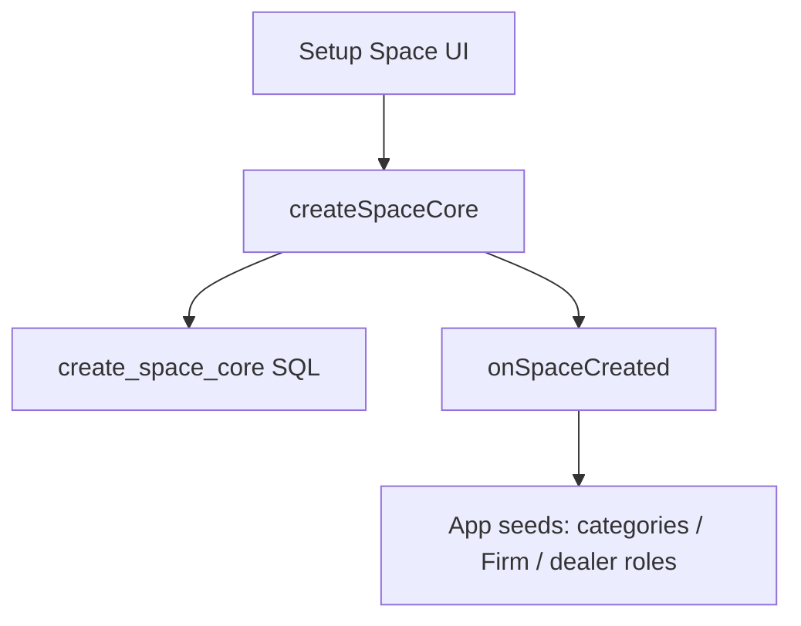

# Architecture — Adaven Platform

## Constraints

- Share **code**, not accounts. Vouchap, Wholestore, and future apps each have independent Supabase and registration.
- Third-party login (Google, Apple, Microsoft, …) is a **platform** capability. Credentials, bundle IDs, and Supabase Auth providers are **per app**.
- **One git repo, one kernel, independent product ships.** `packages/*` is always HEAD for every app (no per-app kernel pin). Platform changes on `main` are not a production release. Web ships via GitHub Actions path filters → Wrangler Direct Upload (one app per matching path), or that app’s CLI / EAS. **Never** Git-connect Cloudflare Pages to this repo (one push would rebuild every connected app).

## Source of truth

| What | Where |
|---|---|
| Vouchap **app** | `apps/vouchap-app` | Supabase `giuacjbfsyrristkigmz` |
| Wholestore **app** | `apps/wholestore-app` | Supabase `foyecolycmxcneflpant` |
| Platform kernel | `packages/*` | code only, not a tenant. **Auth + Setup Space + Management** live in `packages/platform-ui` and are **imported**, not copied. Members, invites, and Space roles (Admin/Member) are **inside Management**, not sidebar columns. |
| Historical Vouchap git backup | https://github.com/jamesgao27/Vouchap | do not iterate the app there |

EAS `projectId` (`f98c5cea-fd51-41e3-9c9c-1512c6b1a8e7`) and bundle id `com.vouchap.app` are unchanged.

Cloudflare Pages projects are **Direct Upload** (`wrangler pages deploy` from `apps/vouchap-app` or `apps/wholestore-app`). Git source of the code is `jamesgao27/Adaven-platform`; Pages must **not** be Git-connected. Auto-publish is GitHub Actions with per-app path filters. See `docs/PUBLISH.md`.

## Information architecture

- **Kernel UI**: login / register / reset-password / setup-space / handle-invitations / invite, plus **Management** (space info, personal info, switch space, sign out, Members, Space roles). Apps `export { ManagementScreen as default } from '@adaven/platform-ui'`.
- **Web left sidebar**: chrome only (brand, current space → Management, user card → Management, invitation badge). **Every nav column is a product business page** (`getSidebarNavItems`). Do not put Team / Space roles in the rail.
- Product extras on Management use `getManagementMenuItems` (Vouchap: Accounts, Firm Permissions, billing, …).
- Shared list chrome (`DataTable`, `CenterModal`, `ProjectListCard` / `ProjectListRow`) lives in `platform-ui`. Wholestore Factory maps Vouchap Firm: Dealers ← Clients, Orders ← Engagements (multi-SKU lines), Catalog ← Service Catalog (SKU without items).

## Layout

```text
Adaven-platform/
  packages/
    platform-core/
    platform-ui/
    db-platform/
  apps/
    vouchap-app/
    wholestore-app/
  docs/ARCHITECTURE-PLATFORM.md
```

Apps depend on `@adaven/platform-core` and `@adaven/platform-ui`. npm workspaces **always link the local packages on HEAD**. Do not fork kernel versions per app; independence is **when** each product is exported and uploaded, not which kernel commit it develops against.

## Space creation



- `create_space_core` (Wholestore): `spaces` + `user_spaces` + `current_space_id` + `provider.providers` or `consumer.consumers`. `spaces.kind` is `provider` | `consumer` (not Vouchap `firm` | `client`).
- Vouchap currently still calls product RPC `create_space_with_user` (Firm/CRM seeds in SQL) **and** the JS hook for client categories / Firm SKU fallback.
- New apps should use `create_space_core` + `registerOnSpaceCreated` only.

## Roles

Platform stores `user_spaces.is_admin` (Admin / Member). Membership RPCs live in `020_space_membership.sql`: invite (optional admin), accept/decline, remove, leave, last-admin guard. Wholestore enrollment is `provider.consumers` (Factory ↔ Dealer), not orders. This is **not** Vouchap Firm `permission_roles` (order managers).

## Independent release

1. Change platform packages on `main` — both apps see it in local/dev immediately. This is **not** a production update by itself (GitHub Actions path filters exclude `packages/**`).
2. When Vouchap should go live: push that touches `apps/vouchap-app/**`, or Actions **Deploy Vouchap Web → Run workflow**, or `npm run vouchap:deploy:web` / EAS from `apps/vouchap-app`.
3. When Wholestore should go live: push that touches `apps/wholestore-app/**`, or Actions **Deploy Wholestore Web → Run workflow**, or `npm run wholestore:deploy:web` (and its EAS). The other product stays on the last Direct Upload / store binary.
4. Run `db-platform` SQL on **that** app's Supabase only, when ready.
5. Disconnect Git on Pages `vouchap` if it still tracks `jamesgao27/Vouchap`. Do not connect `wholestore` to Git.
